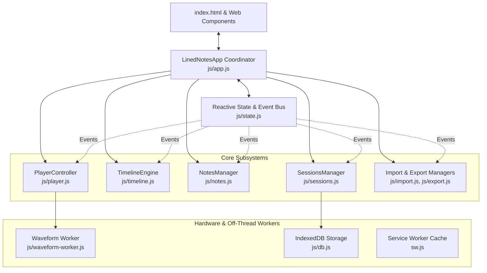

## Application Overview: Lined Notes

**Lined Notes** is a client-side, privacy-first audio and video annotation studio and Progressive Web App (PWA). It is built entirely on native browser standards: **Vanilla ES Modules**, **Custom Elements (Web Components)**, **Canvas 2D**, **Web Audio**, **Web Workers**, and **IndexedDB**, completely free of heavy framework dependencies or mandatory bundling build steps.



### Key Subsystems & Architecture

1. **Multi-Source Media Engine ([player.js](file:///c:/Users/benb/dev/lined-notes/js/player.js))**
   - **Local Files**: HTML5 `<video>` / `<audio>` decoding supporting container formats (MP4, MKV, WebM, MOV, MP3, WAV, M4A, FLAC, OGG).
   - **Streaming Video**: Embedded YouTube IFrame API integration with oEmbed title resolution, plus direct video URL playback (CORS/MP4/WebM).
   - **Detached Review Mode**: Allows loading, searching, editing, and exporting saved project annotations even when the underlying media file is not present locally.
   - **Live Audio Visualization**: Real-time Web Audio FFT frequency analyzer driving a 32-band reactive spectrum visualizer and spinning vinyl animation.

2. **Waveform & Timeline Renderer ([timeline.js](file:///c:/Users/benb/dev/lined-notes/js/timeline.js), [waveform-utils.js](file:///c:/Users/benb/dev/lined-notes/js/waveform-utils.js))**
   - High-performance, retina-scaled HTML5 `<canvas>` rendering synchronized with theme color tokens.
   - Off-thread Web Worker ([waveform-worker.js](file:///c:/Users/benb/dev/lined-notes/js/waveform-worker.js)) performing EBML audio demuxing and peak calculations via zero-copy `ArrayBuffer` transfers, with graceful fallback to synthetic audio waveform generation.
   - Continuous 60fps pan/zoom scrub mechanics, hover time previews, in-place note marker flags, and A-B range loop bounding.

3. **Annotations & Notes Engine ([notes.js](file:///c:/Users/benb/dev/lined-notes/js/notes.js), [note-card.js](file:///c:/Users/benb/dev/lined-notes/js/components/note-card.js))**
   - Note capture with automatic or locked timecodes, duration ranges ($A \to B$), and colored tag taxonomy.
   - Video snapshot thumbnail capture with an expandable lightbox viewer.
   - Rich text formatting support (Markdown bold/italics/code, plus clickable interactive timecode chips like `⏱️ 01:24.5`).
   - Instant full-text search, tag filter chips, undo history, and jump navigation.

4. **Persistence & Detached Sessions ([sessions.js](file:///c:/Users/benb/dev/lined-notes/js/sessions.js), [db.js](file:///c:/Users/benb/dev/lined-notes/js/db.js))**
   - Transactional IndexedDB persistence with seamless LocalStorage fallback.
   - Non-destructive auto-save, inline project renaming, session search, and metadata tracking.

5. **Interoperability & Data Interchange ([export.js](file:///c:/Users/benb/dev/lined-notes/js/export.js), [import.js](file:///c:/Users/benb/dev/lined-notes/js/import.js))**
   - **Export**: JSON project backups, Markdown (Obsidian/Notion), SubRip (`.srt`), WebVTT (`.vtt`), CSV, standalone interactive HTML reports, and native Web Share API integration.
   - **Import**: Multi-format parser for JSON, SRT, WebVTT, and CSV with replace or merge modes.

6. **Web Components & Design Tokens ([components/](file:///c:/Users/benb/dev/lined-notes/js/components/), [css/](file:///c:/Users/benb/dev/lined-notes/css/))**
   - Custom Elements: [<mobile-tabs>](file:///c:/Users/benb/dev/lined-notes/js/components/mobile-tabs.js), [<modal-dialog>](file:///c:/Users/benb/dev/lined-notes/js/components/modal-dialog.js), [<note-card>](file:///c:/Users/benb/dev/lined-notes/js/components/note-card.js), [<tag-picker>](file:///c:/Users/benb/dev/lined-notes/js/components/tag-picker.js), [<time-display>](file:///c:/Users/benb/dev/lined-notes/js/components/time-display.js), [<toast-notification>](file:///c:/Users/benb/dev/lined-notes/js/components/toast-notification.js).
   - Structured CSS token system in [tokens.css](file:///c:/Users/benb/dev/lined-notes/css/tokens.css) with zero-flicker light/dark mode transitions and dedicated mobile touch layouts.

---

## Architectural Analysis: Current Strengths & Pressure Points

### Strengths
- **Zero build friction**: Can be served with any static web server; instantaneous feedback loop.
- **Event-Driven Decoupling**: [state.js](file:///c:/Users/benb/dev/lined-notes/js/state.js) acts as an event bus (`state.on`, `state.emit`), avoiding hard couplings between unrelated features (e.g. notes updating without knowing about timeline canvas internals).
- **Service Worker Strategy**: "Live at HEAD" network-first strategy in [sw.js](file:///c:/Users/benb/dev/lined-notes/sw.js) with `updateViaCache: 'none'` ensures instantaneous updates when online, without sacrificing offline PWA resilience.

### Pressure Points (Where the code has grown heavy)
1. **[player.js](file:///c:/Users/benb/dev/lined-notes/js/player.js) (1,438 lines)** has become a "god class": it handles HTML5 media, YouTube IFrame API lifecycle, live Web Audio FFT analysis, Web Worker message coordination, and fullscreen hover/idle timers.
2. **Inline HTML Handlers & Proxy Duplication**: [index.html](file:///c:/Users/benb/dev/lined-notes/index.html) relies heavily on `onclick="app.someMethod()"`, forcing [app.js](file:///c:/Users/benb/dev/lined-notes/js/app.js#L549-L860) to maintain ~310 lines of trivial pass-through proxies solely to attach methods to `window.app`.
3. **Dual Keyboard Shortcut Definitions**: Keyboard shortcuts are declared in a map inside [app.js](file:///c:/Users/benb/dev/lined-notes/js/app.js#L151-L233) and separately hand-written as static markup inside the shortcuts modal in [index.html](file:///c:/Users/benb/dev/lined-notes/index.html#L814-L867), creating risk of drift.
4. **Implicit Event Bus Contracts**: Over 20 string-based event names (`'medialoaded'`, `'timeupdate'`, `'timelinechanged'`, `'noteschange'`, `'filereset'`) are passed without a single enum or constant table, creating risk of silent typos.

---

## Modular & Maintainable Refactoring Plan (Without Substantive Changes)

These recommendations preserve the zero-build, vanilla ES module stack while significantly reducing file sizes, eliminating duplicate code, and improving readability.

### 1. Decompose `PlayerController` into Focused Sub-Modules
Break [player.js](file:///c:/Users/benb/dev/lined-notes/js/player.js) into composable units that live under `js/player/`:

```
js/player/
├── index.js                  (Clean, thin PlayerController facade ~350 lines)
├── youtube-adapter.js        (YouTube iframe API, ticker loop, oEmbed resolution)
├── audio-visualizer.js       (Web Audio context, FFT analyser, audio bars animation)
├── waveform-pipeline.js      (Worker dispatch, EBML demuxing, synthetic peak fallback)
└── fullscreen-manager.js     (Fullscreen listeners, idle mouse hide timer)
```

- **Benefit**: [player.js](file:///c:/Users/benb/dev/lined-notes/js/player.js) shrinks from 1,438 lines to ~350 lines.
- **Zero substantive impact**: `app.player.togglePlay()`, `app.player.seekTo()`, etc. maintain their exact existing signatures and external behaviors.

### 2. Centralize Keyboard Shortcuts into a Dynamic Registry
Extract shortcuts into a single configuration module:

```javascript
// js/shortcuts.js
export const SHORTCUTS = [
  { key: ' ', display: 'Space or K', desc: 'Play / Pause playback', action: (app) => app.player.togglePlay() },
  { key: 'n', display: 'N', desc: 'Capture timestamp & focus note', action: (app) => app.notes.captureCurrentTime() },
  { key: 'arrowleft', display: '← / →', desc: 'Skip backward / forward 5s', action: (app, e) => app.player.skip(e.shiftKey ? -1 : -5) },
  // ...
];
```

- **Benefit**:
  1. The keydown listener in [app.js](file:///c:/Users/benb/dev/lined-notes/js/app.js) executes directly from the registry.
  2. The keyboard shortcuts modal in [index.html](file:///c:/Users/benb/dev/lined-notes/index.html) can render dynamically from the same array on open, guaranteeing that help documentation never goes stale.

### 3. Replace Inline `onclick="app..."` Proxies with Declarative Action Delegation
Notice how [sessions.js](file:///c:/Users/benb/dev/lined-notes/js/sessions.js#L32-L47) and [<note-card>](file:///c:/Users/benb/dev/lined-notes/js/components/note-card.js) already use data attributes and custom events (`data-session-action="..."`, `note-jump`). 

We can apply this pattern to header and control buttons:
```html
<!-- Instead of onclick="app.newProject()" -->
<button class="btn btn-ghost btn-sm" data-action="new-project">New Project</button>
<button class="btn btn-ghost btn-sm" data-action="open-url">Open URL</button>
```

In [app.js](file:///c:/Users/benb/dev/lined-notes/js/app.js):
```javascript
document.addEventListener('click', (e) => {
  const target = e.target.closest('[data-action]');
  if (!target) return;
  const action = target.dataset.action;
  if (this.actions[action]) this.actions[action](target, e);
});
```
- **Benefit**: Removes ~300 lines of repetitive proxy wrappers (`jumpPrevNote`, `jumpNextNote`, `setInPoint`, `setOutPoint`, `openExportModal`, etc.) in [app.js](file:///c:/Users/benb/dev/lined-notes/js/app.js).

### 4. Formalize Event Bus Constants & State Actions
In [state.js](file:///c:/Users/benb/dev/lined-notes/js/state.js), introduce an explicit `EVENTS` constant object:

```javascript
export const EVENTS = Object.freeze({
  MEDIA_LOADED: 'medialoaded',
  TIME_UPDATE: 'timeupdate',
  PLAY_STATE_CHANGE: 'playstatechange',
  TIMELINE_CHANGED: 'timelinechanged',
  NOTES_CHANGE: 'noteschange',
  FILE_RESET: 'filereset',
  REQUEST_SAVE: 'requestsave',
  REQUEST_EXPORT: 'requestexport',
  THEME_CHANGED: 'themechanged',
  REQUEST_MOBILE_TAB: 'requestmobiletab'
});
```

- **Benefit**: Autocomplete support, prevention of silent spelling errors, and centralized documentation of app-wide event contracts.

### 5. Expand Existing Web Components to Remaining Modals
You already have [<modal-dialog>](file:///c:/Users/benb/dev/lined-notes/js/components/modal-dialog.js) and [<mobile-tabs>](file:///c:/Users/benb/dev/lined-notes/js/components/mobile-tabs.js). You can cleanly encapsulate:
- `<session-card>`: Extract the dynamically generated HTML template currently in [sessions.js](file:///c:/Users/benb/dev/lined-notes/js/sessions.js#L260-L330) into a custom element alongside [note-card.js](file:///c:/Users/benb/dev/lined-notes/js/components/note-card.js).
- `<media-badge>`: Encapsulate the header file status badge logic (`file-badge`, dot, file name display, and tooltip).

### 6. Notes List Rendering Performance (Virtual/Chunked Rendering)
In [notes.js](file:///c:/Users/benb/dev/lined-notes/js/notes.js#L300-L370), `renderNotes()` clears the list and constructs DOM nodes for every note. When projects reach 100+ annotations:
- Render using a `DocumentFragment` (which minimizes reflows).
- Use an `IntersectionObserver` on note cards to lazily render thumbnail images or snapshots only when scrolled into view.

---

## Suggested Phased Approach

| Phase | Focus | Complexity | Risk |
|---|---|---|---|
| **Phase 1** | **Constants & Shortcuts Registry**: Introduce `EVENTS` in [state.js](file:///c:/Users/benb/dev/lined-notes/js/state.js) and extract `shortcuts.js`. | Low | None |
| **Phase 2** | **Decompose `player.js`**: Split out `audio-visualizer.js`, `youtube-adapter.js`, and `fullscreen-manager.js` into `js/player/`. | Medium | Very Low (pure modular extraction) |
| **Phase 3** | **Event Delegation in `app.js`**: Convert header & transport buttons to `data-action` and remove proxy boilerplate. | Low | Very Low |
| **Phase 4** | **Component Refinement**: Create `<session-card>` and add image lazy-loading to `<note-card>`. | Low | None |
